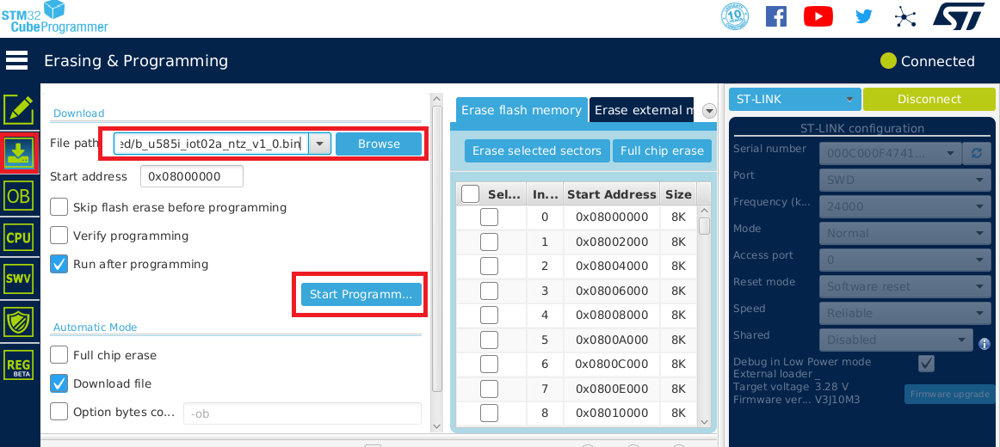

# QuickStart and Device Setup Instructions


## Firmware Flashing
* Download and install a serial console application (TeraTerm for example) and STM32CubeProgrammer
* Download and extract [b_u585i_iot02a_ntz_v1_1.zip](https://saleshosted.z13.web.core.windows.net/demo/st/b_u585i_iot02a_ntz_v1_1.zip)
* Connect the board with a Micro USB to a PC cable located on the top of the board.
Do not connect the USB-C port or the micro USB port at the bottom.  
* Open the STM32CubeProgrammer and connect it to the board by clicking the *Connect* button on the top right.
* Click the *Erasing&Programming* button (second button on the left sidebar) 
  * It is recommended to run a *Full Chip Erase* (top right of the screen), but this step is optional.
  * Click *Browse* and navigate to your unzipped .bin file.
  * *Start Address* should be auto-detected to 0x08000000.
  * Click the *Start Programming* button (see the screenshot below).
* Once flashing is complete Disconnect the board from the programmer and re-plug the device.    

* 

## Configuring Device Certificates
* To configure the Server CA certificate, a commands needs to be executed on the serial terminal console 
that will take the certificate as input. 
* Open the serial console terminal. If you are seeing no output, you can type **help**
on the terminal to trigger the device to respond.
* Next, we need to configure the Server CA certificate. 
The command will expect the certificate to be pasted along with the BEGIN and END lines.
If this process is successful, a log line will print *Success: Certificate loaded to label: 'root_ca_cert'*.
Ignore the "Could not open" warnings on the screen during the process.
Run the following command and paste the
[Starfield Root CA G2 Certificate](#Starfield-Root-CA-G2) below 
at the ">" prompt:
  * pki import cert root_ca_cert
* To generate the device's X509 credentials, we will need to generate a private key and
a self-signed certificate based on the public/private key pair that's also generated internally.
Enter the following commands:
  * pki generate key
  * pki generate cert 
* Capture the certificate output of the pki generate cert command along with BEGIN CERTIFICATE and 
END CERTIFICATE lines and paste it into a file that we will upload during IoTConnect device setup below.
* You can always obtain the same generated certificate by executing **pki export cert tls_cert** at the command prompt.
* Keep the terminal application open. We will need it again to configure the device connection details.

## IoTConnect setup
* Create a template and add the following items to your template of choice:
  * "version" - data type STRING
  * "class" - data type STRING
  * "confidence" - data type INTEGER
* Create a new device:
  * Select the above-mentioned template as the template during device creation.
  * Choose the *Use my certificate* option.
  * Do not select any *Certificate Authority*.
  * For the *Device Certificate* field at the bottom click the *Browse* button and select your file 
where you saved the generated certificate in the steps above.
* When complete, navigate to the device Info tab (should come up by default) and 
click the *Connection Info* hyperlink on the top the right.
* Note the following values in the device *Connection info* screen 
which we will use for the device runtime configuration in the next steps:
  * *Your Unique Device ID* that you used to create the device will be used as *thing_name*.
  * *Host*, which will be used for the *mqtt_endpoint* value.
  * Reporting topic will be in a format: $aws/rules/msg_d2c_rpt/yourdevice/ABCDEFG/2.1/0.
Note the capital letter string *CD* value like "XG2Y2M1" which we will use as *iotc_cd* value in the 
[Configuring Device Connection Parameters](#Configuring-Device-Connection-Parameters) steps below.

## Configuring Device Connection Parameters
* Enter the following commands on the serial terminal to configure the MQTT connection:
  * conf set thing_name your-device-id
  * conf set iotc_cd your-cd
  * conf set mqtt_endpoint your-endpoint
  * conf set mqtt_port 8883
* Enter the following commands to set up the WiFi connection for your device: 
  * conf set wifi_ssid your-wifi-ssid 
  * conf set wifi_credential your-wifi-password
* Verify values by entering the **conf get** command and examining the output.
* Enter **conf commit**. Note that must commit the changes so that they take effect.
* Enter **reset** to reset the device.

The device should connect at this point, and you should be able to see data in the Telemetry and Latest Value tabs.

## Starfield Root CA G2

```pem
-----BEGIN CERTIFICATE-----
MIID7zCCAtegAwIBAgIBADANBgkqhkiG9w0BAQsFADCBmDELMAkGA1UEBhMCVVMx
EDAOBgNVBAgTB0FyaXpvbmExEzARBgNVBAcTClNjb3R0c2RhbGUxJTAjBgNVBAoT
HFN0YXJmaWVsZCBUZWNobm9sb2dpZXMsIEluYy4xOzA5BgNVBAMTMlN0YXJmaWVs
ZCBTZXJ2aWNlcyBSb290IENlcnRpZmljYXRlIEF1dGhvcml0eSAtIEcyMB4XDTA5
MDkwMTAwMDAwMFoXDTM3MTIzMTIzNTk1OVowgZgxCzAJBgNVBAYTAlVTMRAwDgYD
VQQIEwdBcml6b25hMRMwEQYDVQQHEwpTY290dHNkYWxlMSUwIwYDVQQKExxTdGFy
ZmllbGQgVGVjaG5vbG9naWVzLCBJbmMuMTswOQYDVQQDEzJTdGFyZmllbGQgU2Vy
dmljZXMgUm9vdCBDZXJ0aWZpY2F0ZSBBdXRob3JpdHkgLSBHMjCCASIwDQYJKoZI
hvcNAQEBBQADggEPADCCAQoCggEBANUMOsQq+U7i9b4Zl1+OiFOxHz/Lz58gE20p
OsgPfTz3a3Y4Y9k2YKibXlwAgLIvWX/2h/klQ4bnaRtSmpDhcePYLQ1Ob/bISdm2
8xpWriu2dBTrz/sm4xq6HZYuajtYlIlHVv8loJNwU4PahHQUw2eeBGg6345AWh1K
Ts9DkTvnVtYAcMtS7nt9rjrnvDH5RfbCYM8TWQIrgMw0R9+53pBlbQLPLJGmpufe
hRhJfGZOozptqbXuNC66DQO4M99H67FrjSXZm86B0UVGMpZwh94CDklDhbZsc7tk
6mFBrMnUVN+HL8cisibMn1lUaJ/8viovxFUcdUBgF4UCVTmLfwUCAwEAAaNCMEAw
DwYDVR0TAQH/BAUwAwEB/zAOBgNVHQ8BAf8EBAMCAQYwHQYDVR0OBBYEFJxfAN+q
AdcwKziIorhtSpzyEZGDMA0GCSqGSIb3DQEBCwUAA4IBAQBLNqaEd2ndOxmfZyMI
bw5hyf2E3F/YNoHN2BtBLZ9g3ccaaNnRbobhiCPPE95Dz+I0swSdHynVv/heyNXB
ve6SbzJ08pGCL72CQnqtKrcgfU28elUSwhXqvfdqlS5sdJ/PHLTyxQGjhdByPq1z
qwubdQxtRbeOlKyWN7Wg0I8VRw7j6IPdj/3vQQF3zCepYoUz8jcI73HPdwbeyBkd
iEDPfUYd/x7H4c7/I9vG+o1VTqkC50cRRj70/b17KSa7qWFiNyi2LSr2EIZkyXCn
0q23KXB56jzaYyWf/Wi3MOxw+3WKt21gZ7IeyLnp2KhvAotnDU0mV3HaIPzBSlCN
sSi6
-----END CERTIFICATE-----
```
