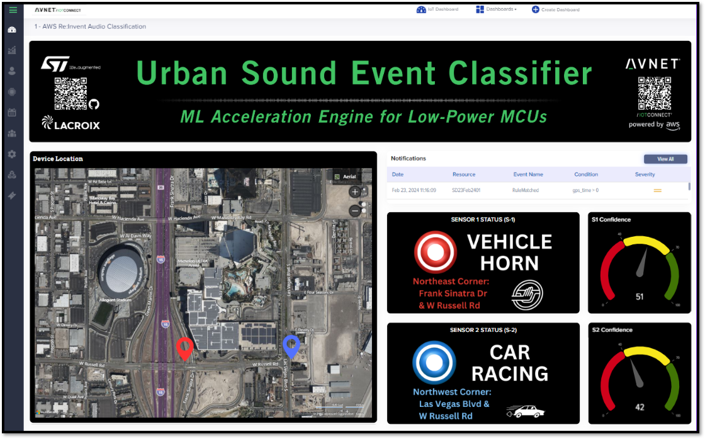

# Avnet's Smart City Noise Detection Solution: Harnessing IoT and AI

## Introduction 
Avnet's Smart City Noise Detection Solution harnesses the power of IoT and AI to tackle the growing challenges of noise pollution and public safety in urban environments. By integrating advanced sensor technologies and real-time analytics, this solution provides city authorities with effective tools to monitor and mitigate noise disturbances, thereby enhancing the quality of life for residents and improving urban safety. Leveraging the robust capabilities of the B-U585I-IOT02A Discovery kit with STM32U5 Secure MCU for IoT, our solution is designed to deliver actionable insights, ensuring scalable, secure, and efficient urban management.

## Project Scope

Originally developed from a collaborative GitHub project with AWS, this local version allows for streamlined, on-site operation using pre-generated AI model files under STMicroelectronics' [SLA0044 license](https://www.st.com/resource/en/license/SLA0044_SE-MW.pdf). This approach enhances the flexibility and responsiveness of urban noise management systems.

### Recognized Sounds

Our AI model efficiently identifies critical urban sounds including:

-   Alarms
-   Dog Barking
-   Rushing Water
-   Race Car Noise / Auto Racing
-   Vehicle horns

### Telemetry and Confidence Reporting

Telemetry includes a confidence metric, reflecting the accuracy of noise classification in real-time. Dynamic confidence thresholds can be adjusted either globally or for individual classifications, ensuring the reliability of data on urban noise levels. Additionally, each sound classification is accompanied by precise location data, enabling city authorities to pinpoint the exact origin of noise incidents. This integration of location information enhances the capability to respond effectively to specific noise pollution challenges within the urban environment.

## Key Features

### Optimized for Efficiency: Local Processing Advantages 

For immediate testing and use on your STM32U5 series board, this project facilitates a straightforward local setup with pre-generated AI model files, eliminating the need for complex cloud integrations. Local classification significantly reduces latency, minimizes cloud and connectivity costs, and lowers power consumption. The system is meticulously designed to be low-powered, making it suitable for deployment as either a battery-powered solution or an energy-harvesting setup. This ensures efficient operation and enhances the sustainability of the urban noise monitoring system.

### Advanced Noise Classification
By leveraging state-of-the-art acoustic sensitivity coupled with advanced AI algorithms, our system excels in distinguishing between various urban sounds—from traffic noises to human activity. This intelligent noise classification enables precise identification of noise types, allowing city officials to implement targeted interventions for specific sources of noise pollution. The capability to accurately classify sounds ensures responses tailored to the nature of the noise, thereby optimizing the effectiveness of noise management strategies in urban environments.

### Harmonized System Integration
Our solution is designed to seamlessly integrate with existing urban surveillance infrastructure, augmenting city-wide noise monitoring and management capabilities. This integration facilitates a unified approach to city management, where audio monitoring complements visual surveillance, providing a comprehensive sensory overview of urban environments. By enhancing existing systems with our sophisticated noise detection technology, cities can achieve a more holistic view of public spaces, leading to better-informed decisions and more effective urban planning and safety measures.

### Powered by IoTConnect
The backbone of this solution is Avnet's IoTConnect platform, which guarantees scalability, data privacy, and ease of deployment across various urban settings.

## Getting Started

### Full Demonstration Setup
Recreate the entire setup as demonstrated in our comprehensive **[ML Audio Classifier Demo Setup Guide](https://github.com/avnet-iotconnect/iotc-freertos-stm32-u5-ml-demo/blob/main/DEMO.md)**.

### Quickstart Guide
Jumpstart your deployment with the **[Quickstart Guide](https://github.com/avnet-iotconnect/iotc-freertos-stm32-u5-ml-demo/blob/main/DEVELOPMENT.md)**, tailored for quick setup on the B-U585I-IOT02A Discovery kit.

### Development Environment Setup
For a deeper dive into project development and local compilation, refer to the **[Development Instructions](https://github.com/avnet-iotconnect/iotc-freertos-stm32-u5-ml-demo/blob/main/DEVELOPMENT.md)**.

----------
## Support and Additional Resources
For further assistance and more detailed information on our Smart City solutions, please contact our experts or visit our support pages:

-   **Talk to our Experts:** [Avnet IoT Solutions Contact](https://www.avnet.com/wps/portal/us/solutions/iot/contact-us/)
-   **Call Us:** 866-345-7638
-   **Email:** info@softwebsolutions.com

## Pricing
For pricing details tailored to the scope of your deployment, please contact our sales team directly.+
